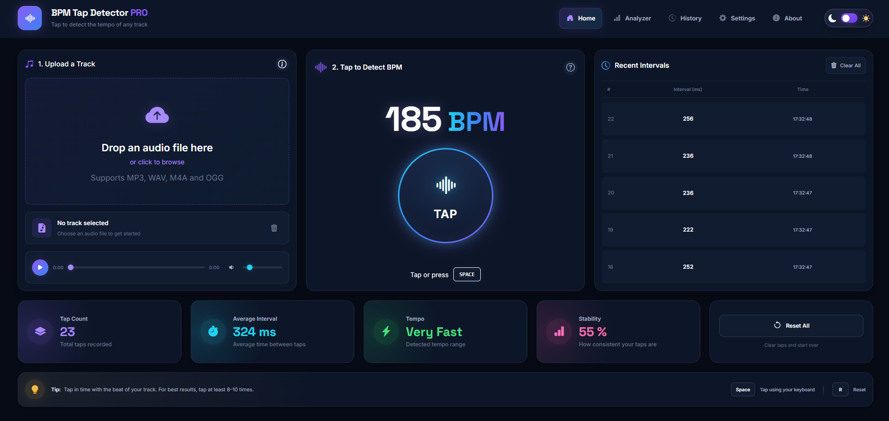

<div align="center">

# 🎵 BPM Tap Detector PRO

A modern and responsive BPM tap detector built with **HTML, CSS and Vanilla JavaScript**.

Upload a local audio track, play it directly in the browser and tap along with the beat to calculate the BPM, average tap interval, tempo and tapping stability.

[](https://developer.mozilla.org/en-US/docs/Web/HTML)
[](https://developer.mozilla.org/en-US/docs/Web/CSS)
[](https://developer.mozilla.org/en-US/docs/Web/JavaScript)

### [🚀 Live Demo](https://johnyisbackk.github.io/js-bpm-tap-detector-pro/)

</div>

---

## 📸 Preview



---

## ✨ Features

- 🎵 Upload and play local audio files
- ▶️ Custom audio player
- ⏱️ Audio progress control
- 🔊 Volume slider and mute control
- 👆 Tap button for BPM detection
- ⌨️ Spacebar support for tapping
- 🔢 Real-time BPM calculation
- ⏱️ Average interval calculation
- ⚡ Tempo classification
- 📊 Tap stability percentage
- 🕒 Recent tap interval history
- 🗑️ Clear interval history
- 🔄 Reset functionality
- 🌙 Light / Dark theme
- 💾 Theme saved with Local Storage
- 📱 Fully responsive design

---

## 🛠️ Technologies

- HTML5
- CSS3
- Vanilla JavaScript
- Bootstrap Icons
- Google Fonts
- Local Storage
- File API
- HTML Audio API

---

## 🧠 How It Works

The application records the exact time of every tap using:

```js
performance.now();
```

The difference between two consecutive taps creates an interval in milliseconds.

For example:

```text
Tap 1 → 1000 ms
Tap 2 → 1500 ms

Interval → 500 ms
```

The application calculates the average of the most recent tap intervals and converts it into BPM.

```text
60,000 ms / 500 ms = 120 BPM
```

Using several recent intervals makes the BPM result more stable than calculating it from only two taps.

The app also evaluates:

- average interval between taps
- tempo category
- tapping stability
- recent interval history

---

## 🎧 Local Audio Files

Audio files are processed locally in the browser.

The selected file is converted into a temporary browser URL using:

```js
URL.createObjectURL();
```

This allows the application to play the selected audio file without uploading it to a server.

---

## ⌨️ Keyboard Shortcuts

| Key     | Action           |
| ------- | ---------------- |
| `Space` | Record a BPM tap |
| `R`     | Reset tap data   |

---

## 📂 Project Structure

```text
bpm-tap-detector-pro/
│
├── index.html
├── style.css
├── script.js
├── LICENSE
├── README.md
├── preview.png
```

---

## 🚀 Run Locally

Clone the repository:

```bash
git clone https://github.com/JohnYisBackk/bpm-tap-detector-pro.git
```

Open the project folder:

```bash
cd bpm-tap-detector-pro
```

Then open:

```text
index.html
```

in your browser.

You can also run the project using a local development server such as **Live Server** in Visual Studio Code.

---

## 📚 What I Learned

This project helped me practice and understand:

- working with local audio files
- using the JavaScript File API
- creating temporary URLs with `URL.createObjectURL()`
- releasing object URLs with `URL.revokeObjectURL()`
- controlling the HTML `<audio>` element with JavaScript
- working with audio duration and current playback time
- handling volume and mute controls
- using `performance.now()` for precise timing
- calculating intervals between user actions
- calculating BPM from milliseconds
- working with arrays using `push()`, `slice()` and `reduce()`
- dynamically rendering UI elements
- handling keyboard events
- separating application state from DOM rendering
- building reusable JavaScript functions
- saving theme preferences with Local Storage
- creating responsive dashboard layouts with CSS Grid and Flexbox

---

## 👨‍💻 Author

**Samuel Jahn**

- GitHub: [@JohnYisBackk](https://github.com/JohnYisBackk)
- Portfolio: [samueljahn.sk](https://samueljahn.sk)

---

## 📄 License

This project is licensed under the **MIT License**.

See the [LICENSE](./LICENSE) file for details.

---

<div align="center">

Built with HTML, CSS & Vanilla JavaScript 🎵

</div>
